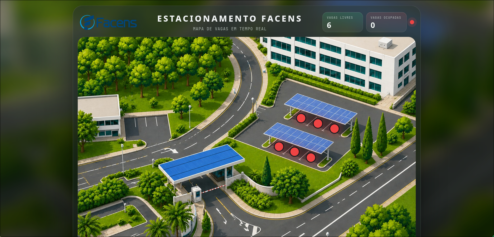

# Proximity Dashboard FACENS



Real-time parking dashboard for monitoring ESP32 proximity sensors through the serial port and visualizing parking spot status in the browser.

## Technologies

- Node.js
- CommonJS
- Express
- HTML, CSS and JavaScript

## Dependencies

Project dependencies:

- `express`
- `serialport`
- `@serialport/parser-readline`
- `ws`

Install:

```bash
npm install
```

## Available Scripts

- `npm start` - starts the server at `http://localhost:3000`
- `npm run dev` - starts the server in watch mode
- `npm run ports` - lists available serial ports

## Environment

- `SERIAL_PORT` - serial port used by the ESP32
- Windows fallback: `COM7`
- Baud rate: `115200`

Example:

```bash
SERIAL_PORT=COM7
```

## How To Run

### 1. Upload the ESP32 code

Open `parking-system-esp32.ino` in the Arduino IDE and upload it to the ESP32.

### 2. Install dependencies

```bash
npm install
```

### 3. Start the server

#### Windows PowerShell

```powershell
$env:SERIAL_PORT="COM7"
npm start
```

#### Windows CMD

```bat
set SERIAL_PORT=COM7
npm start
```

#### macOS / Linux

```bash
SERIAL_PORT=/dev/ttyUSB0 npm start
```

### 4. Open the dashboard

Open:

```text
http://localhost:3000
```
